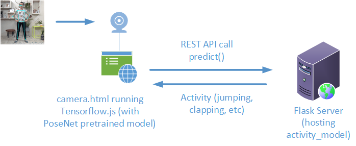

# Deploy Activity Recognition Model 

We will use flask server to host the activity recognition model that we train. The camera.html running in the browser will capture the video of the person using a webcam on the laptop (computer)  and use the Posenet (running using Tensorflow.js) to extract keypoints from the video frames.  The keypoints are then send to the predict() REST API of the flask server to get the predicted activity. The predicted activity is then displayed on the camera.html page. 



## Create a Virtual Environment 

If you already have Anaconda or Miniconda installed, create a conda environment by typing the following at the Anaconda prompt:

```python
conda create -n it3103env python=3.8
conda activate it3103env 
# in the it3103env
conda install pip
```

## Install the Required packages

Install the necessary packages using the requirements.txt file. 

```python
# inside the git repo it3103/week15 directory 
pip install -r requirements.txt 
```

## Run the Flask application

Unzip your activity_model.zip and copy the activity_model folder into the `app` folder of your flask app. The activity_model folder contained the keras saved model. Run the flask using the following: 

```
flask run
```

and you should see the following after a while: 

```
Running on http://127.0.0.1:5000/ (Press CTRL+C to quit)
```

Open your browser and type the following to access the camera.html: 

```
http://localhost:5000/camera.html
```

You will see a warning asking permission to use your built-in camera, just click 'Allow'.   Now you can try doing any of the following actions to see if the application can detect correctly:

JUMPING", "JUMPING_JACKS", "BOXING", "WAVING_2HANDS", "WAVING_1HAND", "CLAPPING_HANDS"


